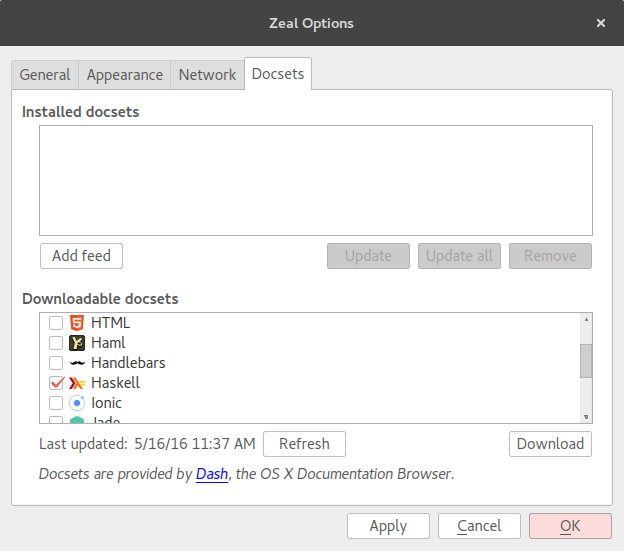

# Taller de validación en Haskell

[Enlace al evento](http://www.meetup.com/Haskell-MAD/events/230656250/)

## Requisitos

### Stack

El primer paso para comenzar a desarrollar los programas del taller de forma cómoda es instalar Stack si aún no lo tenemos. 

Stack es un programa que nos va a ayudar a instalar de forma aislada el compilador GHC *(Glasgow Haskell Compiler)* así como compilar nuestro programa e instalar dependencias.

Para instalar Stack podéis seguir los pasos que se indican en el [sitio web de Stack](http://docs.haskellstack.org/en/stable/README/), o bien podéis trabajar dentro de un contenedor de docker a partir de una imagen con Stack ya instalado:

``` sh
docker run -ti --volume $(pwd):/app sellpy/haskell-stack bash
```

Una vez tengáis Stack instalado probad a compilar el proyecto que contiene los ejercicios del taller:

``` sh
git clone https://github.com/haskellMAD/workshop-validation.git
cd workshop-validation
stack build
```

Si el comando `stack build` termina sin dar ningún error tendremos cinco ejecutables, uno por cada ejercicio del taller (que son cinco). Cada ejecutable se llama `exN` donde `N` es el número del ejercicio, para invocar un ejecutable podéis utilizar el comando `stack exec exN` y en los ficheros en los que tenéis que trabajar son `exN/Main.hs` donde `N` es también el úmero del ejercicio en el que vais a trabajar.

Los comandos de stack con los que más vamos a trabajar son:

- `stack build` para compilar nuestro proyecto, es decir, todos los ejecutables  (en el fichero `workshop-validation.cabal` es en el que se le indica a Stack como generar cada ejecutable).
- `stack exec exN` para ejecutar nuestra solución al ejercicio `N`.
- `stack ghci --main-is exN` para lanzar una shell interactiva, una vez dentro de esta shell escribe `:l Main` para cargar el módulo `Main` del ejercicio `N` en el que estamos trabajando.

### Zeal/Dash/Hoogle (opcional)

[Zeal](https://zealdocs.org/)/[Dash](https://kapeli.com/dash) son dos programas (Zeal para Gnu/Linux y Dash para OSX) que te permiten navegar fácilmente y totalmente *offline* documentaciones de varias herramientas y lenguajes. En nuestro caso nos instalaremos el docset de Haskell (ver opciones → instalar docset).



Una vez descargado el docset puedes acceder o buscar en la documentación de Haskell.


[Hoogle](https://wiki.haskell.org/Hoogle#Searches) es un programa de línea de comandos que una de las cosas interesantes que tiene es que nos permite buscar por *type signatures*. Para instalarlo podéis usar el mismo Stack: `stack install hoogle` y una vez instalado ejecutad `hoogle data` para que se cree el índice local.

Luego de esto podemos fácilmente buscar desde nuestro terminal por nombre de función:
``` sh
$ hoogle getArgs
System.Environment getArgs :: IO [String]
System.Posix.Env.ByteString getArgs :: IO [ByteString]
Graphics.UI.GLUT.Initialization getArgsAndInitialize :: MonadIO m => m (String, [String])
```

Podemos pedir que muestre la documentación [Haddock](https://www.haskell.org/haddock/) de una función:
``` sh
$ hoogle --info getArgs
System.Environment getArgs :: IO [String]

Computation getArgs returns a list of the program's command line arguments (not including the program name). 

From package base
getArgs :: IO [String]
```

Podemos también buscar por *type signature*:
``` sh
$ hoogle 'x a -> x b -> x b' | head
Control.Applicative (*>) :: Applicative f => f a -> f b -> f b
Prelude (>>) :: Monad m => m a -> m b -> m b
Control.Monad (>>) :: Monad m => m a -> m b -> m b
Control.Monad.Instances (>>) :: Monad m => m a -> m b -> m b
Control.Applicative (<*) :: Applicative f => f a -> f b -> f a
Control.Exception.Base finally :: IO a -> IO b -> IO a
Control.Exception finally :: IO a -> IO b -> IO a
Control.OldException finally :: IO a -> IO b -> IO a
Control.Exception.Base onException :: IO a -> IO b -> IO a
Control.Exception onException :: IO a -> IO b -> IO a
```

También podéis acceder a hoogle desde la repl ghci, para ello salvad lo siguiente en `$HOME/.ghci`:

``` haskell
let ghciEscapeShellArg arg = "'" ++ concatMap (\c -> if c == '\'' then "'\"'\"'" else [c]) arg ++ "'"
:def! search return . (":! hoogle " ++) . ghciEscapeShellArg
:def! doc return . (":! hoogle --info " ++) . ghciEscapeShellArg
```

El fichero anterior define dos nuevos comandos en nuestro ghci: `:search` y `:doc`, el primero simplemente busca y el segundo además de buscar muestra la documentación de Haddock, por ejemplo:

``` sh
$ ghci
GHCi, version 7.10.3: http://www.haskell.org/ghc/  :? for help
Prelude> :doc getArgs
System.Environment getArgs :: IO [String]

Computation getArgs returns a list of the program's command line arguments (not including the program name). 

From package base
getArgs :: IO [String]
Prelude> :search getArgs
System.Environment getArgs :: IO [String]
System.Posix.Env.ByteString getArgs :: IO [ByteString]
Graphics.UI.GLUT.Initialization getArgsAndInitialize :: MonadIO m => m (String, [String])
Prelude> 
```

## Ejercicios ##

Ahora comezaremos a hacer los ejercicios que poco a poco nos van a ir introduciendo en el desarrollo con Haskell. Cada ejercicio intenta introducir una mejora en la solución al ejercicio anterior por lo que no te apresures a introducir todas las mejoras en tu primera solución. Lo que intentamos con esto es que vuestro esfuerzo dedicado a realizar cada ejercicio os ayude a construir una intuición para resolver problemas en Haskell, podéis leer más sobre este tema en el artículo de Brent Yorgey [Abstraction, intuition, and the “monad tutorial fallacy”](https://byorgey.wordpress.com/2009/01/12/abstraction-intuition-and-the-monad-tutorial-fallacy/)

Si tienes poca experiencia con Haskell te recomendamos echarle un ojo a estos artículos:
- [Entrada/Salida en Haskell](http://aprendehaskell.es/content/EntradaSalida.html)
- [La notación do](http://aprendehaskell.es/content/Monadas.html)
- [Functors, Applicatives and Monads in pictures](http://adit.io/posts/2013-04-17-functors,_applicatives,_and_monads_in_pictures.html)

