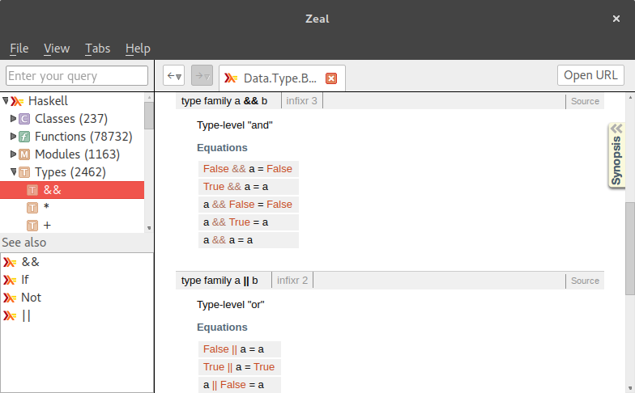

# Taller de validación en Haskell

[Enlace al evento](http://www.meetup.com/Haskell-MAD/events/230656250/)

## Requisitos

### Stack

El primer paso para comenzar a desarrollar los programas del taller de forma cómoda es instalar Stack si aún no lo tenemos. 

Stack es un programa que nos va a ayudar a instalar de forma aislada el compilador GHC *(Glasgow Haskell Compiler)* así como compilar nuestro programa e instalar dependencias.

Para instalar Stack podéis seguir los pasos que se indican en el [sitio web de Stack](http://docs.haskellstack.org/en/stable/README/), o bien podéis trabajar dentro de un contenedor de docker a partir de una imagen con Stack ya instalado:

``` sh
docker run -ti --volume $(pwd):/app sellpy/haskell-stack bash
```

Una vez tengáis Stack instalado probad a compilar el proyecto que contiene los ejercicios del taller:

``` sh
git clone https://github.com/haskellMAD/workshop-validation.git
cd workshop-validation
stack build
```

Si el comando `stack build` termina sin dar ningún error tendremos cinco ejecutables, uno por cada ejercicio del taller (que son cinco). Cada ejecutable se llama `exN` donde `N` es el número del ejercicio, para invocar un ejecutable podéis utilizar el comando `stack exec exN` y en los ficheros en los que tenéis que trabajar son `exN/Main.hs` donde `N` es también el úmero del ejercicio en el que vais a trabajar.

Los comandos de stack con los que más vamos a trabajar son:

- `stack build` para compilar nuestro proyecto, es decir, todos los ejecutables  (en el fichero `workshop-validation.cabal` es en el que se le indica a Stack como generar cada ejecutable).
- `stack exec exN` para ejecutar nuestra solución al ejercicio `N`.
- `stack ghci --main-is exN` para lanzar una shell interactiva, una vez dentro de esta shell escribe `:l Main` para cargar el módulo `Main` del ejercicio `N` en el que estamos trabajando.

### Zeal/Dash (opcional)

[Zeal](https://zealdocs.org/)/[Dash](https://kapeli.com/dash) son dos programas (Zeal para Gnu/Linux y Dash para OSX) que te permiten navegar fácilmente y totalmente *offline* documentaciones de varias herramientas y lenguajes. En nuestro caso nos instalaremos el docset de Haskell (ver opciones → instalar docset).


Una vez descargado el docset puedes acceder o buscar en la documentación de Haskell.




## Ejercicios ##

Ahora comezaremos a hacer los ejercicios que poco a poco nos van a ir introduciendo en el desarrollo con Haskell. Cada ejercicio intenta introducir una mejora en la solución al ejercicio anterior por lo que no te apresures a introducir todas las mejoras en tu primera solución. Lo que intentamos con esto es que vuestro esfuerzo dedicado a realizar cada ejercicio os ayude a construir una intuición para resolver problemas en Haskell, podéis leer más sobre este tema en el artículo de Brent Yorgey [Abstraction, intuition, and the “monad tutorial fallacy”](https://byorgey.wordpress.com/2009/01/12/abstraction-intuition-and-the-monad-tutorial-fallacy/)

> Aquí añadiremos los ejercicios el día del workshop
